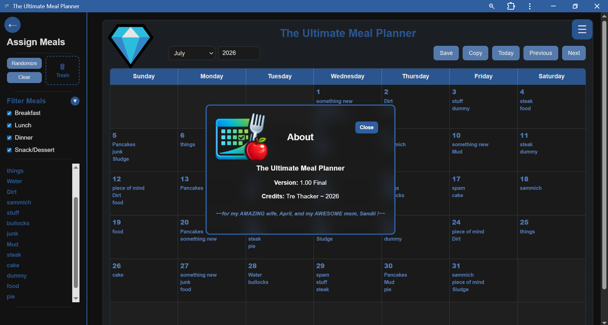

# 🍽️ The Ultimate Meal Planner — Version 1.00 Final

Offline monthly meal planning, recipe management, shopping lists, pantry management, backups, sharing, printing, and more — all in one installable app.



---

## ✨ Overview

**The Ultimate Meal Planner** is an all-in-one meal planning Progressive Web App (PWA) built for users who want a powerful, organized, flexible, and easy-to-use meal planning system.

Plan monthly calendars, manage recipes, generate shopping lists, organize pantry items, backup your data, print calendars, and install the app directly to your device — all without subscriptions or cloud lock-in.

Built to work offline and designed for desktop use today, with future mobile optimization planned.

---

## 🚀 Key Features

### 📅 Monthly Meal Calendar

* Monthly meal planning system
* Previous / Next month navigation
* Today shortcut button
* Manual and automatic saving
* Month-to-month persistent data storage
* Copy an entire month's meal plan into another month

### 🎲 Smart Meal Randomizer

Automatically fill your calendar using selected meal categories.

Features include:

* Category selection

  * Breakfast
  * Lunch
  * Dinner
  * Snack / Dessert

* Meal repeat spacing controls:

  * 1 Week
  * 2 Weeks
  * 3 Weeks
  * Once Per Month

* Intelligent spacing rules:

  * Prevents same-day duplicate recipes
  * Prevents repeat recipes across categories within the selected spacing range
  * Supports multi-category meals correctly

* Not enough meals?

The app can:

* leave blank slots when required
* notify the user
* allow manual filling
* support re-randomizing with different settings

---

### 📖 Recipe Manager

Create and manage recipes with:

* Categories
* Ingredients
* Instructions
* Descriptions
* Prep Time
* Cook Time
* Total Time
* Servings
* Notes
* Nutrition
* Image support

Recipes support multi-category assignment.

---

### 🛒 Shopping Lists

Generate shopping lists directly from planned meals.

Includes support for:

* ingredient consolidation
* pantry-aware logic roadmap
* future smart normalization system

---

### 🥫 Pantry Management

Manage pantry items to improve shopping workflows.

Planned smart pantry logic will support:

* stocked item suppression
* ingredient simplification
* user-controlled pantry behavior

---

### 💾 Import / Export / Backup

Protect your planning data.

Supports:

* Import
* Export
* Backup workflows
* Data portability

---

### 🖨️ Print & Share

Built-in tools for:

* printing calendars
* printing meal plans
* exporting data
* sharing planning information

---

### 🎨 Themes + Dark Mode

Customize your experience with:

* Theme system
* Dark Mode support
* Frosted window styling
* Theme-aware dialogs and interface components

---

### ❓ Built-In Help System

Comprehensive in-app help system covering:

* recipes
* calendars
* randomizer
* backups
* imports / exports
* sharing
* printing
* pantry usage
* general navigation

---

## 📥 Install The App

### Windows Desktop Install

Open the live app URL in Chrome or Edge.

Click:

```text
Install App
```

or:

```text
Address Bar → Install Icon
```

The app can then launch from:

* Desktop shortcut
* Taskbar
* Start Menu

---

### Android Install

VERSION 1.00 FINAL is not recommended for Cell Phone use.
Future version will deploy cell phone compatibility.

Open the app URL.

Tap:

```text
Install App
```

or:

```text
Add to Home Screen
```

---

### iPad / iPhone Install

Open in Safari.

Use:

```text
Share → Add to Home Screen
```

---

## ⚡ Offline Support

The Ultimate Meal Planner uses a Service Worker for offline capability.

Once installed or loaded, the app can continue working without an internet connection for supported workflows.

---

## 🖥️ Supported Platforms

### Currently Tested

* Windows 10
* Google Chrome

### Planned / In Progress

* Android devices
* Apple iPad Pro
* Additional tablet support
* Mobile responsive layouts

---

## 🧰 Technology Stack

Built with:

* HTML5
* CSS3
* Vanilla JavaScript
* IndexedDB storage
* Service Worker caching
* Web App Manifest
* Progressive Web App (PWA) architecture
* GitHub Pages deployment

No frameworks.

No paid services.

No subscriptions.

---

## 🛣️ Roadmap

### Current Release

**Version 1.00 Final**

### Planned Future Work

* Mobile formatting / responsive layouts
* Android optimization
* iPad optimization
* Cross-platform mobile support
* Expanded pantry logic
* Shopping list intelligence improvements
* Additional convenience tools
* UI refinements
* Version 2.00 Mobile Compatibility + Deployment phase

---

## 📸 Screenshots

Main Application View


---

## 👨‍💻 Author

**Tre Thacker**

2026

---

## ❤️ Dedication

for my AMAZING wife, April, and my AWESOME mom, Sandii!

---

## 📄 License

License information coming soon.

---

## 🔧 Repository Notes

This project is deployed through **GitHub Pages**.

Installed users receive updates through the live deployment source.

Major releases may require service worker cache updates for immediate refresh behavior.
